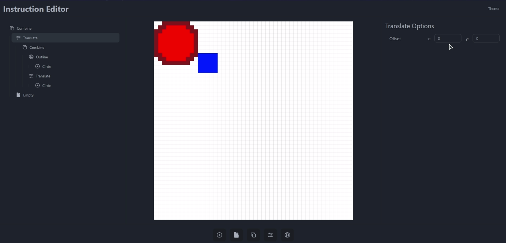

# Pixel Art Renderer

This project is a TypeScript-based pixel art renderer that allows you to create scenes using simple primitives.
It provides a set of builder functions to construct and organize elements in the renderer.

## Table of Contents

- [Upcoming Features](#upcoming-features)
- [Overview](#overview)
- [Installation](#installation)
- [Usage](#usage)
- [File Structure](#file-structure)
- [Contributing](#contributing)

## Upcoming Features

We are currently working on an online visual editor for the pixel art renderer. This new feature is still a
work-in-progress and will be released soon in version 1.0. Below is some screenshot of the upcoming editor:



We are also planning to add the following features in the future:

- Advanced algorithms for manipulating shapes
- Exporting scenes to image files
- Customizable color palettes and themes

## Overview

The pixel art renderer is a simple tool for creating pixel art scenes using basic shapes such as rectangles, circles, and lines.

The renderer is built using the [Konva.js](https://konvajs.org/) library, which provides a canvas-based rendering engine for creating interactive graphics.

The renderer supports the following features:

- Drawing basic shapes such as rectangles, circles, and lines
- Grouping shapes together to create complex scenes
- Customizing the color and position of shapes

## Installation

Clone the repository and install dependencies:

```bash
git clone https://github.com/KhoDis/generative-pixel-art.git
cd generative-pixel-art
npm install
```

## Usage

To use the pixel art renderer, follow these steps:

1. Import the necessary functions and types:

   ```typescript
   import { shape, group, pixel } from "./src/renderer/builders";
   import shapes from "./renderer/shapes";
   import { Point, Color, Group, Pixel } from "./src/renderer/types";
   ```

2. Create a scene using the provided builder functions:

   ```typescript
   const myScene: Group = group(
     [
       shapes.rect(10, 5, { r: 255, g: 0, b: 0 }), // Red rectangle
       shapes.circle(8, { r: 0, g: 255, b: 0 }), // Green circle
       shapes.line({ x: 5, y: 5 }, { x: 15, y: 15 }, { r: 0, g: 0, b: 255 }), // Blue line
     ],
     { x: 0, y: 0 },
   );
   ```

3. Render the scene using the renderer component:

   ```tsx
   import KonvaRenderer from "./components/KonvaRenderer.tsx";

   // ...

   return (
     <KonvaRenderer
       canvasWidth={50}
       canvasHeight={50}
       scale={2}
       scene={myScene}
     />
   );
   ```

4. Adjust parameters such as canvas dimensions, scale, and scene composition to customize the output.

## File Structure

The project follows the following file structure:

- `src/components/`: React components (currently only the renderer)
- `src/renderer/`: Core files for the pixel art renderer
    - `primitives.ts`: Functions for basic constructions of Group and Shape
    - `builders.ts`: Builder/helper functions for constructing elements
    - `shapes/`: Functions for drawing primitives
    - `algorithms`: Algorithms for advanced manipulations
    - `types.ts`: Shared types used in the renderer
- `src/app/`: Application entry point and main components
- `public/`: Static assets

## Contributing

Contributions are welcome! If you have suggestions or improvements, feel free to open an issue or create a pull request.
